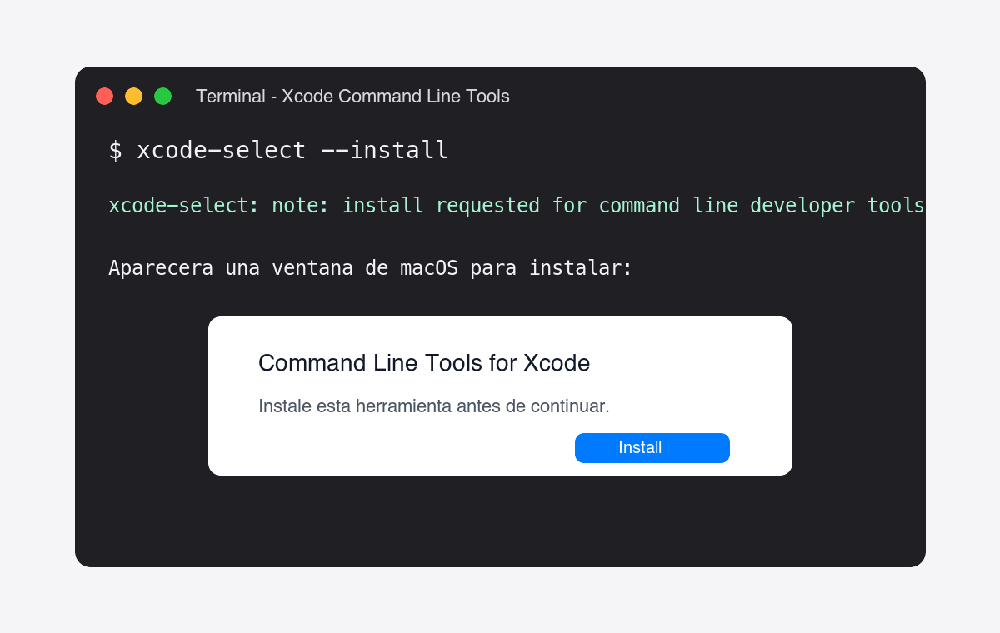
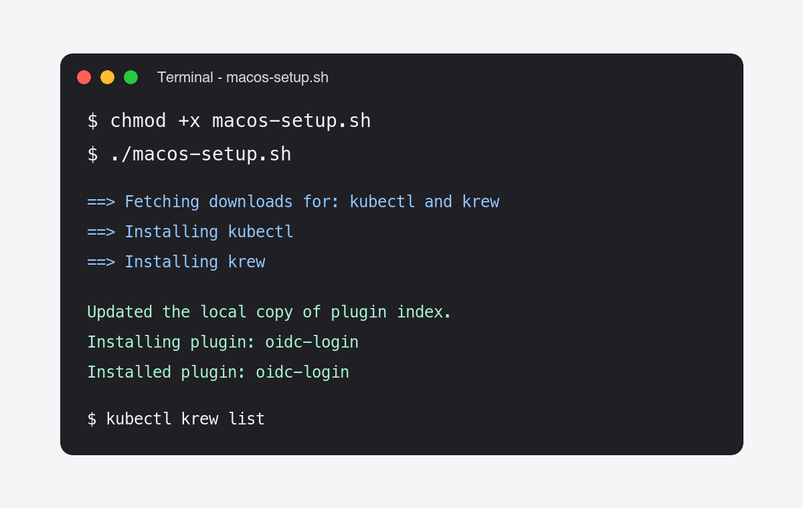

# Usando macOS

## Instalación y configuración

Para poder realizar este tutorial en macOS, primero debemos tener instalada la herramienta de línea de comandos de *Xcode*. Esta herramienta nos permite usar comandos como `git` desde la terminal.

```bash
xcode-select --install
```

Al ejecutar el comando, macOS abrirá una ventana para instalar las herramientas de línea de comandos.

{ style="display: block; margin: 0 auto; width: 1000px;"}

Empezamos clonando el repositorio de *github* y entramos al directorio descargado

```bash
git clone https://github.com/CUDI-PIG/PIG.git
cd PIG
```

Ahora instalamos lo necesario corriendo el archivo `macos-setup.sh`

```bash
chmod +x macos-setup.sh
./macos-setup.sh
```

Con el primer comando lo hacemos ejecutable.

Si la instalación fue exitosa, verá un mensaje similar al siguiente.

{ style="display: block; margin: 0 auto; width: 1000px;"}

Por último, agregamos la siguiente ruta de la herramienta de línea de comandos para *kubernetes*, llamada *krew*, al archivo `~/.zshrc` (configura nuestra *shell* de zsh, que es la shell predeterminada en macOS)

```bash
export PATH="${KREW_ROOT:-$HOME/.krew}/bin:$PATH"
```

Al agregar el `PATH` recargamos la *shell*

```bash
source ~/.zshrc
```

Después, configuramos *kubernetes* ejecutando el archivo `k8s-setup.sh`

```bash
chmod +x k8s-setup.sh
./k8s-setup.sh
```

Se nos pedirá una llave que nos dará el administrador del clúster, como se ve en la siguiente imagen

{ style="display: block; margin: 0 auto; width: 1000px;"}

!!! info "Importante"
    Para obtener la llave, favor de contactar al administrador del sistema de PIG.

Para verificar que la instalación y configuración fue exitosa, usaremos el siguiente comando

```bash
kubectl get pods
```

Al ejecutar el comando se abrirá una página nueva en su navegador predeterminado como la siguiente

{ style="display: block; margin: 0 auto; width: 1000px;"}

Donde deberá ingresar las credenciales de su cuenta en PIG proporcionadas por el administrador. Si al momento de correr un comando de kubernetes no abre la página de keycloak, como se ve en la image, entonces puede agregar la bandera `--skip-open-browser` al archivo `k8s-setup.sh` para que le imprima la URI donde se redirecciona la página de keycloak. Quedaría el comando de `kubectl` de la siguiente manera

```bash
kubectl config set-credentials oidc --exec-command=kubectl \
    --exec-api-version=client.authentication.k8s.io/v1beta1 \
    --exec-arg="oidc-login" \
    --exec-arg="get-token" \
    --exec-arg="--oidc-issuer-url=https://sso.lamod.unam.mx/auth/realms/cudi" \
    --exec-arg="--oidc-client-id=k8s" \
    --exec-arg="--oidc-client-secret=$client_secret" \
    --exec-arg="--skip-open-browser" \
    --kubeconfig=$KUBECONFIG
```

Debe correr el archivo de nuevo para que se apliquen los cambios.

Por predeterminado, se redirrecciona al `localhost:8000` o `localhost:18000`. Si tiene ocupados esos puertos puede, en lugar de agregar la bandera `--skip-open-browser`, agregar la bandera `--listen-address=127.0.0.1:puerto_deseado`.

Si la conexión fue exitosa, en la terminal obtendrá el resultado del comando de *kubernetes*

{ style="display: block; margin: 0 auto; width: 1000px;"}

Este comando nos muestra los pods actuales en PIG.

!!! Success "Éxito"
    Si obtiene un resultado similar al de la imagen ¡¡Felicidades ya puede usar el clúster de PIG!!
